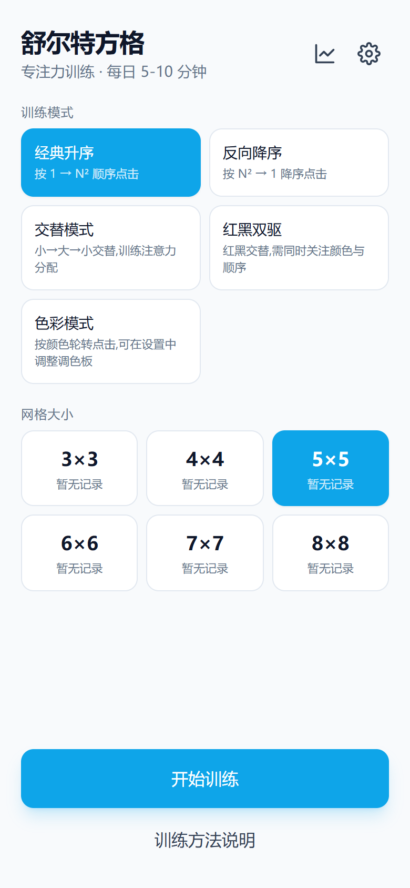

# 初赛 Demo 帖正文 · 舒尔特方格 · 学习工作赛道

> 按照 [初赛参赛指南](https://forum.trae.cn/t/topic/22549) 的推荐模板撰写,可直接复制到【大赛初赛专区】发帖编辑器中。
>
> 截图已生成在 `docs/competition/screenshots/`,路径为相对仓库根目录;发到社区时请改用社区图床或上传到帖子里。

---

## 【标签】

`学习工作`

## 【标题】

【学习工作赛道】舒尔特方格 · 跨平台专注力训练 Demo —— 一份代码 7 端,5 种模式 + 可定制色块 / 形状

## 【正文】

### 0. 先把 Demo 跑起来

- 📦 **Web / PWA(推荐,立即可体验)**: [https://schulte.example.com](https://schulte.example.com) _(替换为实际部署链接)_
- 🖥️ **桌面端**: 同 PWA 链接,支持"安装到桌面"获得类原生体验;Windows / macOS / Linux 安装包可在发布页下载
- 📱 **移动端**: PWA 支持"添加到主屏",iOS / Android 均可独立使用;原生包按需打包

> 体验路径建议: 打开首页 → 选择 5×5 + 经典升序 + 多彩色块 → 开始训练 → 切到"色彩模式"挑 3 种颜色试试 → 进入设置页调整色块样式/形状

### 1. Demo 简介

- **是什么**: 跨平台舒尔特方格(Schulte Grid)专注力训练应用,Web / PWA / Windows / macOS / Linux / iOS / Android 共 7 端一致体验。
- **面向谁**: 7–18 岁学生及家长、18+ 知识工作者 / 备考党、培训老师 / 学校、老年认知训练用户。
- **主要功能(3 个核心)**:
  1. **5 种训练模式**: 经典升序 / 反向降序 / 交替 / 红黑双驱 / 色彩模式,网格大小 3–8 阶自由切换
  2. **可定制视觉**: 6 色调色板(可多选,至少 2 色)+ 多彩色块(纯色/多彩)+ 不规则形状(方块/圆润/正圆/异形)
  3. **按年龄段自动评级 + 历史记录**: 错误次数统计、最佳成绩趋势、本地 IndexedDB 存储

> 首页: 5 种训练模式 + 6 阶网格选择,每格展示当前模式的最佳成绩

> 经典升序 5×5 · 多彩色块 · 异形:数字格从 6 色调色板随机取色,每格独立形状(方块/圆润/正圆/异形),显著提高视觉搜索难度

> 色彩模式 4×4 · 4 色轮转:不再"看数字",而是按颜色顺序点击,训练颜色-顺序双任务能力

> 设置页:数字模式色块样式、单元格形状、严格模式、点击高亮等全部可调

### 2. Demo 创作思路

- **灵感来源**
  - 家人有正在读书的小朋友,每天需要 5–10 分钟的舒尔特方格训练;
  - 自己搜索了一圈发现:免费版广告多、需强制注册、付费门槛高;iPad / 电脑端几乎都要单独 App,跨端体验割裂;
  - 玩法也单一,做几次就失去兴趣,坚持不下来。

- **想解决的问题**
  - 零广告、零注册、零付费的舒尔特方格工具;
  - 跨端一致体验(家里电脑 / 公司平板 / 通勤手机);
  - 可定制化降低厌倦感:多色 / 多色块 / 多形状;
  - 按年龄段量化进步,而不是凭感觉。

- **为什么做这个方向**
  - 舒尔特方格本身已经过 60 多年心理学验证,价值明确;
  - **Tauri 2 + Vue 3 + Vite + TypeScript** 的现代跨端栈让我能用一份代码覆盖 7 端,而不是为每个平台单独实现;
  - TRAE 让我一个人就能完成从需求分析、技术选型、UI 实现、单元测试到跨端配置的全流程,过去这种规模需要一个小团队。

### 3. Demo 体验地址

- **在线体验(PWA,推荐)**: _[请替换为实际部署的 HTTPS 链接]_ (https://schulte.example.com)
- **本地构建产物**: 仓库根目录 `dist/`(已通过 `vue-tsc --noEmit && vite build` 验证,`vue-tsc` 零错误,`vite build` 产物可用)
- **HTML 格式文件**: 仓库内 `dist/index.html` 即为可独立打开的入口(PWA 离线需在 HTTPS 或 localhost 下访问)
- **跨端安装包**: Windows / macOS / Linux 桌面,iOS / Android 移动端原生包,均已通过 Tauri 2 完成配置与验证(代码已就绪,平台 SDK / Xcode / Android Studio 等需在目标机器上单独安装)

### 4. TRAE 实践过程

整个项目从需求分析到 Demo 完成,完全基于 **TRAE IDE** 完成对话、规划、生成与重构。

- **关键任务一:需求澄清 + 技术选型**
  - 关键步骤截图(已附在下方"关键步骤截图"小节)
  - 涉及模块:`src/types/index.ts`、`src/utils/{shuffle,mode,rating}.ts`
  - 输出:确定 5 种训练模式、3–8 阶网格、年龄段评级、严格模式、IndexedDB 持久化的产品骨架

- **关键任务二:核心游戏逻辑 + 单元测试**
  - 关键步骤截图(已附在下方"关键步骤截图"小节)
  - 涉及模块:`src/utils/__tests__/{shuffle,mode,rating}.test.ts`
  - 输出:纯函数核心 + 43+ 单元测试全部通过(Vitest)

- **关键任务三:UI 实现 + 状态管理 + 持久化**
  - 关键步骤截图(已附在下方"关键步骤截图"小节)
  - 涉及模块:`src/views/{Home,Play,Settings,History,About}.vue`、`src/stores/{settings,game,history}.ts`
  - 输出:响应式 UI + Pinia 三个 store + localStorage 持久化

- **关键任务四:跨端配置(Tauri 2 / PWA)**
  - 关键步骤截图(已附在下方"关键步骤截图"小节)
  - 涉及模块:`src-tauri/{tauri.conf.json,Cargo.toml}`、`vite.config.ts`(PWA 插件)
  - 输出:Web/PWA + Windows/macOS/Linux + iOS/Android 7 端构建配置就绪

- **关键任务五:可定制化增强(多色 + 多色块 + 多形状)**
  - 关键步骤截图(已附在下方"关键步骤截图"小节)
  - 涉及模块:`src/utils/colorPalette.ts`、`src/stores/{settings,game}.ts`、`src/views/{Play,Settings}.vue`
  - 输出:6 色调色板(可多选,至少 2 色) + 纯色/多彩色块 + 方块/圆润/正圆/异形 4 种形状,均有单元测试覆盖

#### 关键步骤截图(>3 张)

-  首页:5 种模式 + 6 阶网格 + 最佳成绩展示
-  经典升序 5×5 · 多彩色块 · 异形
-  色彩模式 4×4 · 4 色轮转
-  设置页:色块样式 / 形状 / 严格模式 / 点击高亮
- _可在 docs/competition/screenshots/ 查看高清原图_

#### 关键任务 Session ID(>3 个)

> Session ID 由 TRAE 自动生成,**双击 TRAE 对话头像**即可复制。下方为示例占位,请在发帖时替换为实际 ID(每个 Session ID 对应 TRAE 一次完整对话任务)。

- Session 1(需求澄清 + 技术选型): _[待替换]_
- Session 2(核心游戏逻辑 + 单元测试): _[待替换]_
- Session 3(UI 实现 + 状态管理 + 持久化): _[待替换]_
- Session 4(跨端配置 Tauri 2 / PWA): _[待替换]_
- Session 5(可定制化增强 多色/多色块/多形状): _[待替换]_

### 5. 报名帖链接

- [👉 报名帖(舒尔特方格 · 学习工作赛道)](https://forum.trae.cn/t/topic/_your_topic_id_) _请在报名审核通过后,把链接替换为实际帖子 URL_

---

## 发帖后自检

- [ ] 标题、标签已设置(标签: `学习工作`)
- [ ] 正文 4 大板块齐全:Demo 简介 / 创作思路 / 体验地址 / TRAE 实践过程
- [ ] 关键步骤截图 ≥ 3 张
- [ ] 关键 Session ID ≥ 3 个
- [ ] 报名帖链接已附在文末
- [ ] 体验链接(在线 PWA / HTML / 视频)至少 1 个可访问
